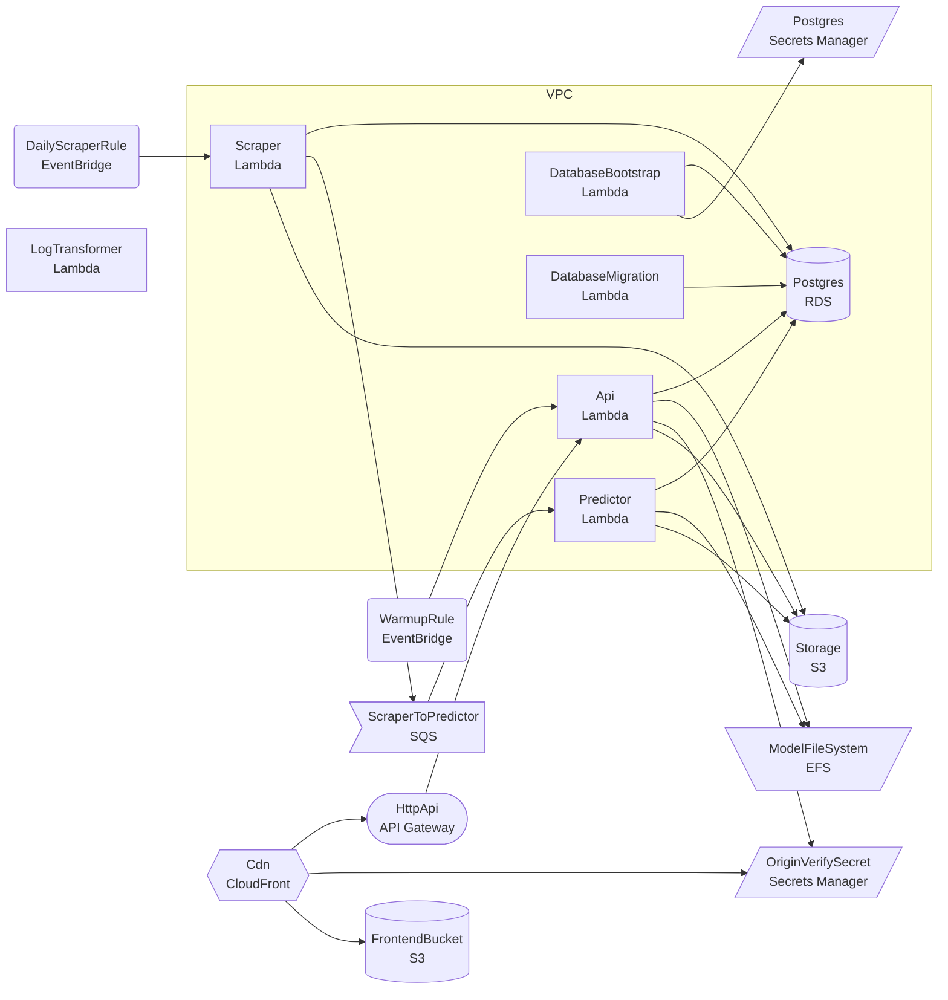
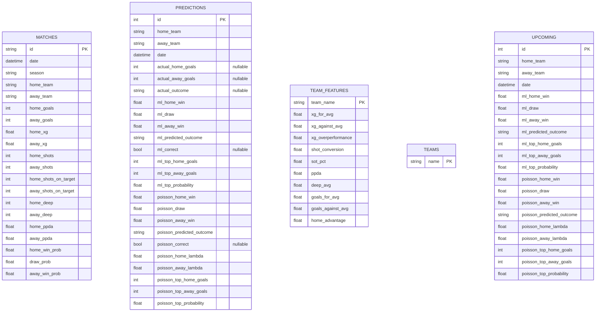

# Match Predictor

Premier League match outcome predictor using two approaches: a gradient boosting ML model and a Poisson baseline.

## How the predictions work

### ML Model (GradientBoostingClassifier)

Classifies each match as home win, draw, or away win using 15 features derived from each team's last 5 matches.

**Features per team (7 each, 14 total):**

| Feature | What it measures |
|---------|-----------------|
| xgFor | Average expected goals scored |
| xgAgainst | Average expected goals conceded |
| xgOverperf | Actual goals minus xG — are they finishing above or below expectation? |
| shotConv | Goals per shot — finishing efficiency |
| sotPct | Shots on target per shot — shot quality |
| ppda | Passes allowed per defensive action — pressing intensity (lower = more aggressive) |
| deep | Deep completions — passes into the final third |

**Plus 1 global feature:**

| Feature | What it measures |
|---------|-----------------|
| homeAdvantage | League-wide ratio of home xG to away xG from all prior matches |

All features use only data from before the match being predicted (no future leakage). The model outputs probabilities for each outcome (e.g. 48% home, 24% draw, 28% away).

Scorelines are generated separately using Poisson simulation with the team's rolling xG averages as lambda values.

**Training:** scikit-learn GradientBoostingClassifier (200 estimators, max depth 4, learning rate 0.1). Evaluated with 5-fold TimeSeriesSplit cross-validation to prevent data leakage.

### Poisson Baseline

Simulates 10,000 random matches using each team's average xG.

1. Calculate home team's mean xG from all their home matches → `home_lambda`
2. Calculate away team's mean xG from all their away matches → `away_lambda`
3. Draw 10,000 random scorelines: home goals from `Poisson(home_lambda)`, away goals from `Poisson(away_lambda)`
4. Count home wins, draws, away wins across all simulations → probabilities

No form, no features, no training. Just raw xG averages and random simulation.

**Limitation:** Poisson variance equals its mean. Two teams averaging 1.5 xG produce identical predictions regardless of whether one is consistent and the other volatile. The distribution can't distinguish streaky teams from steady ones.

### Why both?

The Poisson baseline is the simplest credible model. If the ML model can't beat it, the extra features are adding noise rather than signal. The gap between them measures whether form, pressing, shot quality etc. actually predict outcomes better than raw xG averages alone.

## Data

621 Premier League matches from Understat (2024-25 full season + 2025-26 to date). Each match includes goals, xG, shots, shots on target, deep completions, PPDA, and pre-match win probabilities.

## Local development

### Prerequisites

- Node.js 22+ (managed by Volta)
- pnpm 10+
- Python 3.12+
- uv (Python package manager)
- Docker

### First time setup

```bash
pnpm install
pnpm setup:local
```

This starts Postgres in Docker, scrapes match data, generates predictions, runs database migrations, and seeds the database.

### Running

```bash
pnpm dev
```

Starts Postgres (Docker), FastAPI (port 4400), and React frontend (port 3300).

### Other commands

```bash
pnpm test             # run all tests
pnpm refresh          # re-scrape data and regenerate predictions
```

## Architecture

_Auto-generated from `cdk.out/DeployStack.template.json` — run `pnpm arch:diagram` to refresh._

<!-- ARCH:START -->

<!-- ARCH:END -->

## Database schema

_Auto-generated from `packages/ml/src/match_predictor/db_models.py` — run `pnpm db:diagram` to refresh._

<!-- DB-SCHEMA:START -->

<!-- DB-SCHEMA:END -->
